  

<h1 align="center">🧠 CMP — Content Marketing Planner (AI-Powered Multi-Agent Strategy Engine)</h1>

  An AI-powered content marketing strategist that transforms a short brief into a complete marketing plan — including personas, messaging, campaigns, posts, and a ready-to-execute content calendar — powered by multi-agent planning and LLM reasoning.

  
  
  
  
  

---

## 🌟 Overview

**CMP (Content Marketing Planner)** is an AI-driven system that acts like a senior marketing strategist — instantly generating a full content strategy from a short brief.

CMP orchestrates **four specialized agents** that collaborate via structured JSON:

- 🎯 **Planner Agent — Strategy & Goal Mapping**  
  Understands the brief, clarifies audience, objectives, KPIs, channels, and constraints.

- 🔍 **Research Agent — Insights & Market Context**  
  Uses a Tavily-style web research tool to retrieve trends, competitor insights, audience pain points, and market opportunities.

- ✍️ **Writer Agent — Content & Campaign Generation**  
  Produces messaging pillars, campaign concepts, hooks, CTAs, and platform-specific content ideas.

- 📈 **Optimizer Agent — Metrics & Experimentation**  
  Uses a metrics simulator to score content by CTR, impressions, clarity, and relevance — then selects top performers and proposes experiments.

CMP generates **strategy**, **personas**, **messaging**, **campaigns**, **posts**, **calendars**, and **experiments** — all inside a clean Streamlit dashboard.

---

## 🎨 UI Preview

  

---

## 🧩 Key Features

### 🔹 Multi-Agent Planning Workflow  
- Planner → Researcher → Writer → Optimizer  
- Structured JSON output  
- Modular design for debugging, tuning, and extension  

### 🔹 Strategy & Insights Engine  
Converts a short brief into:  
- User personas  
- Objectives & KPIs  
- Channel strategy  
- Messaging & positioning  
- Customer journey mapping  
- Trend & competitor insights  

### 🔹 Campaign & Content Generation  
- Campaign concepts with scoring  
- Ranked content ideas  
- CTA-ready platform-specific suggestions  
- Hooks, angles, and storytelling patterns  

### 🔹 AI-Driven Optimization  
- Metrics simulator estimates CTR, impressions & engagement  
- Optimizer agent selects top-performing content  
- Auto-generates A/B experiments and learning loops  

### 🔹 Automated Content Calendar  
- Ready-to-use 30–90 day calendar  
- Channels, frequencies, themes, campaigns, and CTAs  
- Export-friendly structure  

### 🔹 Clean Streamlit Dashboard  
- Strategy overview  
- Messaging & personas  
- Campaigns & posts  
- Calendar & experiments  
- All rendered in a minimal, user-friendly UI  

---

## 🧠 System Architecture

```mermaid
flowchart LR
    U[User / Brief] --> APP[Streamlit UI]

    APP --> A1[Planner Agent<br/>Goals • KPIs • Personas]
    A1 --> STRAT[Strategy JSON]

    STRAT --> A2[Research Agent<br/>Web Search • Insights • Trends]
    A2 --> INSIGHTS[Insights JSON]

    INSIGHTS --> A3[Writer Agent<br/>Messaging • Campaigns • Posts]
    A3 --> CONTENT[Content Ideas • Hooks • Drafts]

    CONTENT --> METRICS[Metrics Simulator<br/>CTR • Impressions]
    METRICS --> A4[Optimizer Agent<br/>A/B Testing • Experiments]
    A4 --> FINAL[Final Strategy • Calendar • Experiments]
```

  

<b>From brief → strategy → campaigns → posts → calendar → experiments</b>

    FINAL --> APP
## ⚙️ Installation
Clone the repository:
git clone https://github.com/<your-username>/Content-Marketing-Planner.git
cd Content-Marketing-Planner
Create & activate a virtual environment:

## macOS / Linux
python -m venv .venv
source .venv/bin/activate

## Windows
python -m venv .venv
.venv\Scripts\activate

## Install dependencies:
pip install -r requirements.txt

## Run the app:
streamlit run app.py

## 🔑 Environment Variables
Create a .env file:
env

# LLM provider
HF_API_KEY=your_huggingface_api_key

# Optional: search provider
SEARCH_API_KEY=your_search_provider_key

# Agent Models
PLANNER_MODEL=planning_model
RESEARCH_MODEL=research_model
WRITER_MODEL=writing_model
OPTIMIZER_MODEL=optimizer_model
Load them in your code:

from dotenv import load_dotenv
import os

load_dotenv()
HF_API_KEY = os.getenv("HF_API_KEY")
PLANNER_MODEL = os.getenv("PLANNER_MODEL")

## 🧪 Example Usage
Example JSON payload:

{
  "topic": "SaaS onboarding optimization",
  "audience": "startup founders",
  "goals": ["increase activation", "improve retention"],
  "channels": ["LinkedIn", "Email", "Instagram"],
  "budget": "low",
  "constraints": "no paid ads",
  "duration_days": 30
}

CMP returns:

## Full strategy
Personas
Messaging & positioning
Campaigns & ideas
Posts (per platform)
Calendar (daily posting plan)
Experiment backlog

## 📚 Roadmap
 Auto-publishing to Notion & HubSpot
 Multi-language campaign support
 Real-time social trend extraction
 Visual template export (Canva, Figma)
 Organization-wide strategy memory

## 🤝 Contributing
# Pull requests are openly welcome.

<b>Built by Anshul Tiwari</b>
 